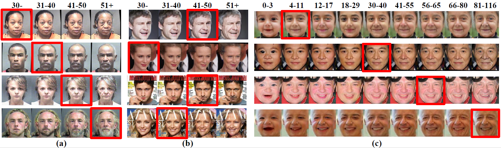

# Age Progression and Regression with Spatial Attention Modules

This repository contains the inference code for paper [**Age Progression and Regression with Spatial Attention Modules**](https://arxiv.org/abs/1903.02133) presented in AAAI2020.

## Environment requirements
* Python 2.7.5
* Pytorch 0.3.1
* CUDA 8.0

## Usage
1. Put your test images under the folder `./datasets/<name_of_dataset>`. Then write a text file with each line containing <name_of_image> and <index_of_age_group>, seperated by a space character. Example input images and list files are provided.
2. Please download [pre-trained models](https://drive.google.com/drive/folders/1CvOCifgE-uBfdHfCI56-1tHJSgr7HZQp?usp=sharing) (two generator networks) and place them under `./checkpoint`.
3. Modify `test.sh` as you see fit.
4. run `test.sh`, and the generation results will be save into `./results`. You could modify the corresponding code in `age_cycle_gan_model.py` to also generate attention maps.

## Citation
>@inproceedings{Li2020AgePA, 
	title={Age Progression and Regression with Spatial Attention Modules}, 
	author={Qi Li and Yunfan Liu and Zhenan Sun}, 
	booktitle={AAAI}, 
	year={2020} 
}

## Acknowledge
The organization of code for this project is largely borrowed from [CycleGAN](https://github.com/junyanz/pytorch-CycleGAN-and-pix2pix) and [GANimation](https://github.com/albertpumarola/GANimation). 

 

